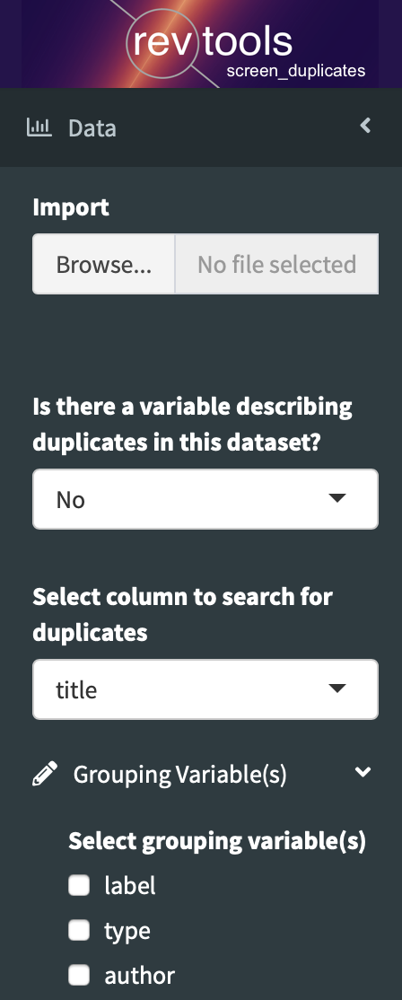
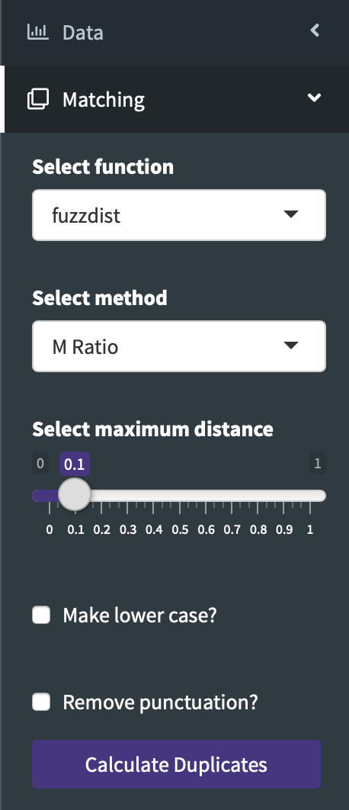
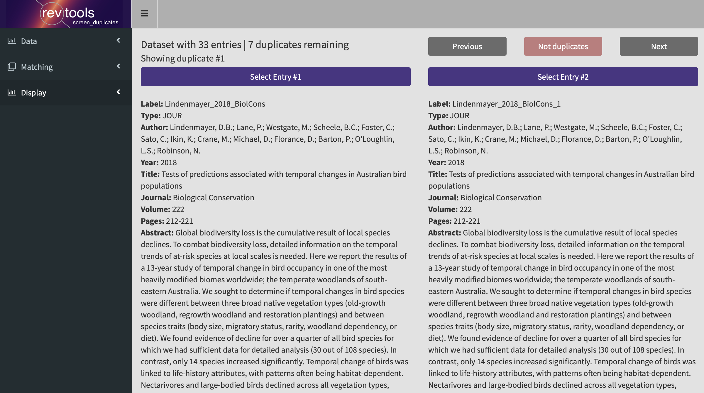

```{r, include = FALSE}
knitr::opts_chunk$set(
  collapse = TRUE,
  comment = "#>"
)
```

You can launch <code>screen_duplicates</code> in one of three different ways. First, if you want to import data within the app, then you just run the function by itself:
```
screen_duplicates()
```

Second, you can launch the app using data from the workspace:
```
data <- read_bibliography("my_data.ris")
screen_duplicates(data)
```

Finally, if you want to save results from the app back to the workspace, then you need to specify an object where that data can be returned:
```
data <- read_bibliography("my_data.ris")
result <- screen_duplicates(data)
```

### Specifying variables
The `Data` tab contains four menus:

<div class="clearfix">
  
  <b>Import:</b> If you haven't passed any data to <code>screen_duplicates</code>, then this allows you to drag-and-drop a dataset directly in to the app.  
  <br>
  <br>
  <b>Is there a variable describing duplicates in this dataset?:</b> If you have identified calculated duplicates in your dataset - either manually, or using <code>find_duplicates</code> - then you can use this to specify where those data are located in your <code>data.frame</code>.  
  <br>
  <br>
  <b>Select column to search for duplicates:</b> This specifies which data should be searched for matches. Most often this will be the article title, but you might want to search for matches in DOIs, or even journal titles.  
  <br>
  <br>
  <b>Select grouping Variable(s):</b> If no variables are specified, then the matching function (<code>find_duplicates</code>) will search every value against every other value in a <code>while</code> loop. This is computationally expensive for large datasets, so this menu allows you to limit the search for matches. The default is to search for titles, but only within the entries with the same journal and year.  

</div>
<br>


### String distances
The `Matching` tab has 5 options:

<div class="clearfix">
  

  <b>Select function</b> has three options:
  - fuzzdist: fuzzy string matching based on the fuzzywuzzy Python library
  - stringdist: Ditto, but from R::stringdist
  - exact: match strings exactly
  <br>
  <br>
  <b>Select method</b> allows you to select a matching algorithm for the specified function.
  <br>
  <br>
  <b>Select maximum distance</b> sets the threshold for matching pairs of strings.
  <br>
  <br>
  <b>Make lower case</b> and <b>remove punctuation</b> do just that.
</div>
<br>

### App behaviour
If the selected algorithm doesn't detect any duplicates with the specified settings, then it will show a warning message to that effect. If it does locate some potential duplicates, then it will then present pairs of potential duplicates to you, and invite you to select which you would like to keep:



Once you have checked all possible duplicates, the app will prompt you to save your data as an exported file. Alternatively, you can exit the 'save' screen and click 'exit app' to return your saved results to the workspace.

## Working with large datasets
To follow

## Classifying duplicates by source
To follow