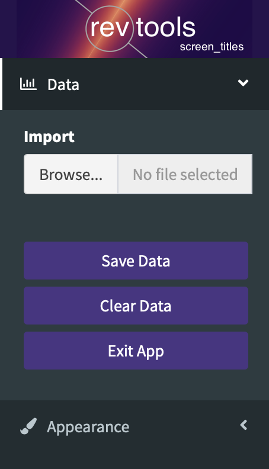
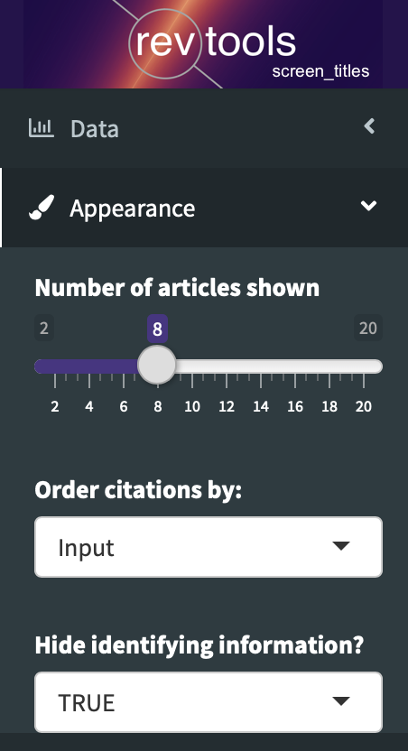
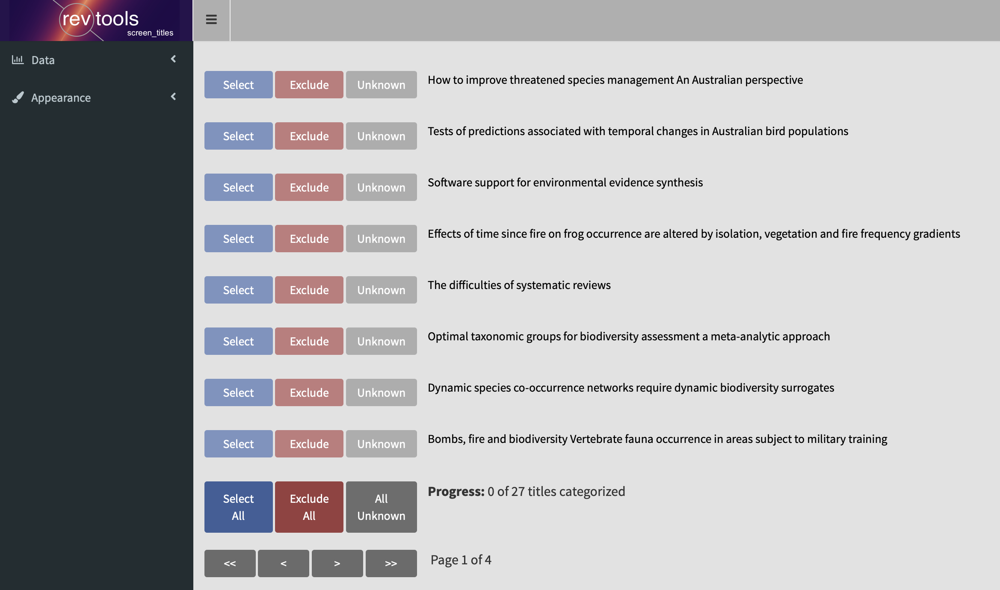
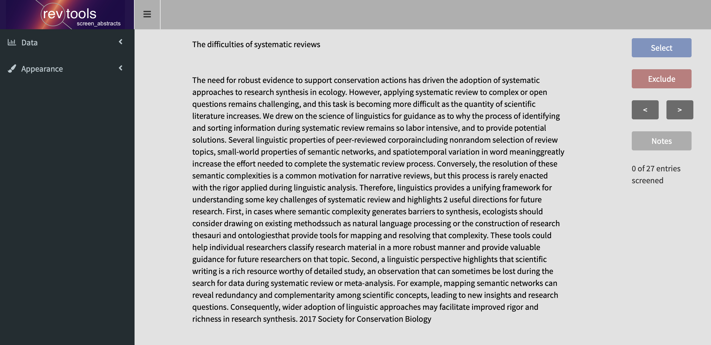

```{r, include = FALSE}
knitr::opts_chunk$set(
  collapse = TRUE,
  comment = "#>"
)
```

In the systematic review community, the standard method to sort scientific material (such as articles and reports) is via manual screening. In general, this screening process is split into several stages: first titles are screened and the relevant articles kept; then the abstracts are screened for retained articles to see which of those may still be useful; and finally full-text articles are screened. revtools currently supports title and abstract screening only.

### Title screening
Title screening is achieved using the function <code>screen_titles</code>. You can run this function without any commands to launch the app in 'empty' mode, allowing you to load data via the 'browse' button; or with an object of class <code>bibliography</code> or <code>data.frame</code>. As with <code>screen duplicates</code>, you get the same app - but slightly different behaviour - depending on how you launch it:

```
screen_titles() # 1. standalone; load in data in the app
result <- screen_titles() # 2. the same, but save back to workspace on exit
screen_titles(data) # 3. launch the app using data from the workspace
result <- screen_titles(data) # 4. specify an object to return data to
```

Once you've loaded the app using <code>screen_titles</code>, you will see the 'Data' tab open in the dashboard:

<div class="clearfix">
  
  These four options work as follows:
  <br>
  <br>
  <b>Import</b> allows you to drag-and-drop a dataset directly in to the app. If you've loaded <code>screen_titles</code> with data, or you have already added some data, then dragging and dropping here will add the new dataset to the existing one (using <code>merge_columns</code> in the background).
  <br>
  <br>
  <b>Save Data</b> Allows you to save your progress to a <code>.rds</code> or <code>.csv</code> file.
  <br>
  <br>
  <b>Clear Data</b> Wipes all data from the app (with a warning first to prevent mistakes).
  <br>
  <br>
  <b>Exit App</b> closes the app, but also invisibly returns a <code>data.frame</code> to the workspace.
</div>
<br>

The 'Appearance' tab doesn't affect the data itself, but how it is displayed.

<div class="clearfix">
  
  This tab has the following options:
  <br>
  <br>
  <b>Number of articles shown</b> allows you to increase or decrease the amount of information on your screen.
  <br>
  <br>
  <b>Order citations by</b> enables you to shuffle between the order of the original dataset; alphabetical order by title; and random (set with <code>rnorm</code>).
  <br>
  <br>
  <b>Hide identifying information</b> is set to TRUE by default, and means only the titles are shown. If set to FALSE, author and journal names are also shown.
</div>
<br>

Once you have loaded the app and added some data, you will be able to manually select or deselect articles one at a time, or in groups using the 'select all' and 'exclude all' buttons. You can also navigate between pages using the arrow buttons, or choose 'unknown' for ambiguous articles. As you make decisions about which titles to include, the color of the text will update to match your selection.




### Abstract screening
Abstract screening is achieved using the function <code>screen_abstracts</code>. Unlike <code>screen_titles</code>, <code>screen_abstracts</code> only shows data for one article at a time; but the two apps are otherwise identical, with the exception that <code>screen_abstracts</code> allows you to make notes for each article should you wish.


