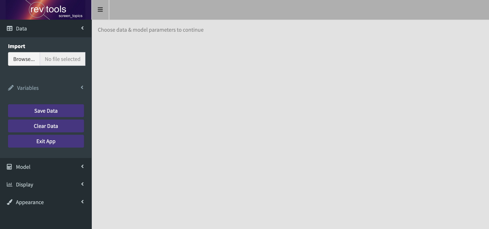
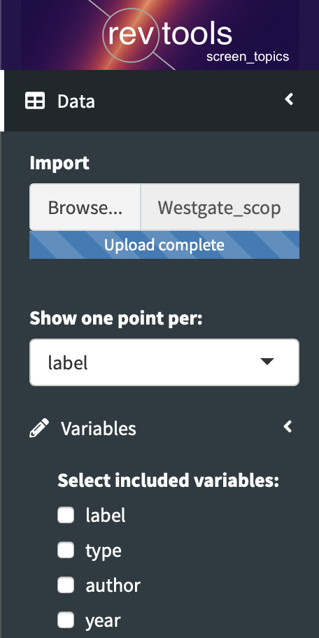
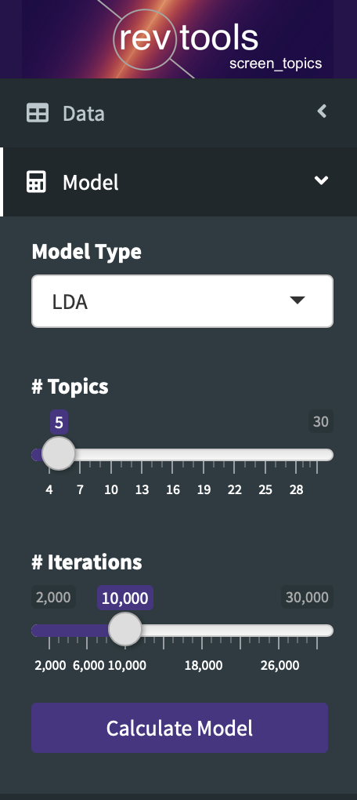
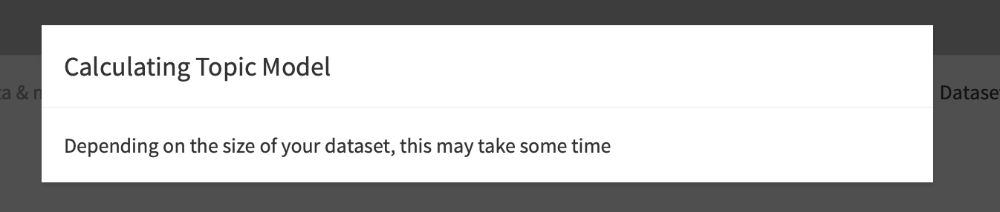
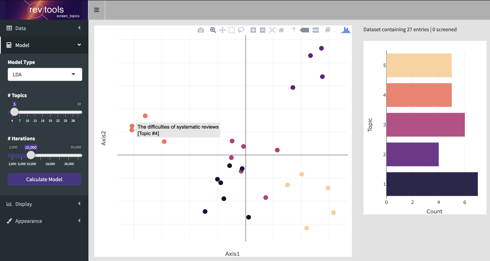
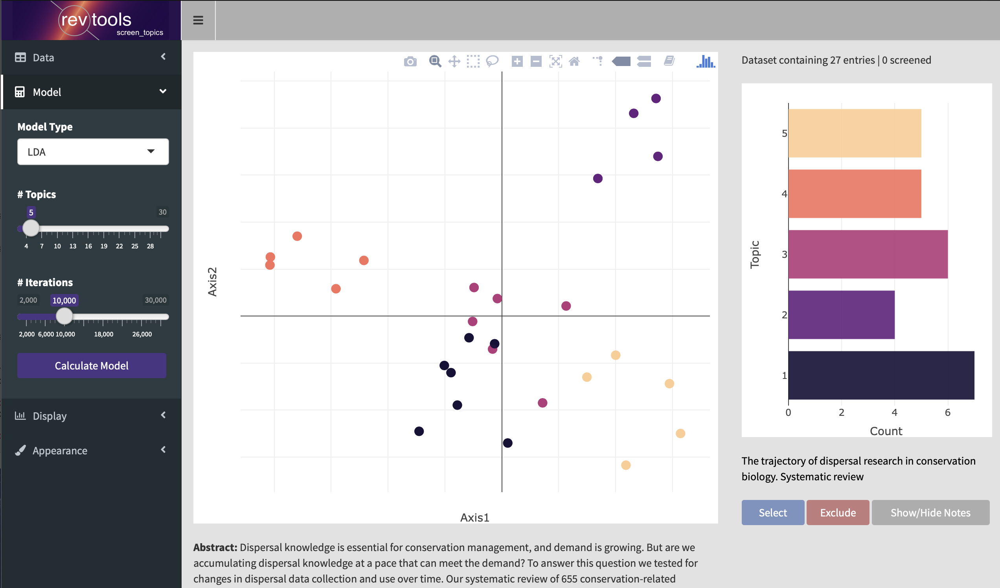
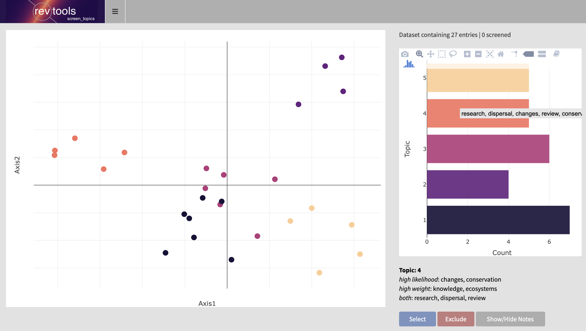
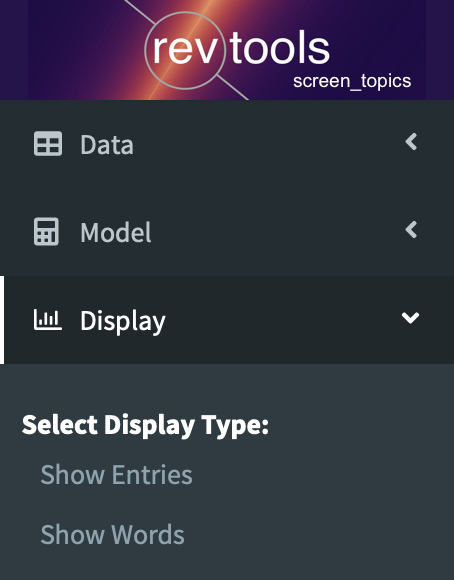
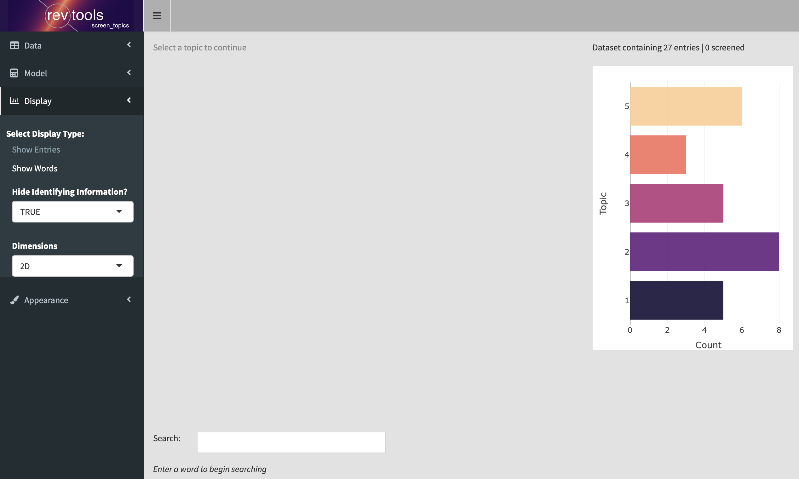
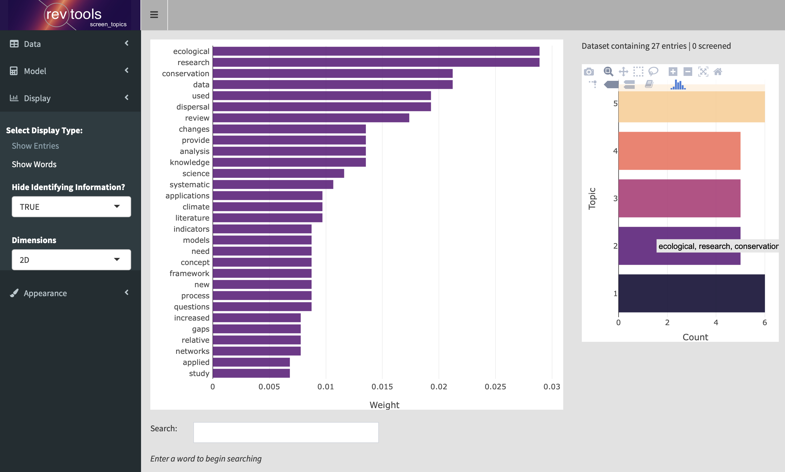

```{r, include = FALSE}
knitr::opts_chunk$set(
  collapse = TRUE,
  comment = "#>"
)
```

The main way to investigate the results of a topic model in revtools is via the command <code>screen_topics</code>. This function behaves similarly to the other apps in this package, but it has many more options.

### Selecting data
If you load <code>screen_topics</code> without any data, it will initially look quite empty:



From here there are a series of stages before you can see the results of your topic model. The first thing you should do is import data via the 'Import' button. Once you have done this, you will be faced with some new options:

<div class="clearfix">
  
  <b>Show one point per</b> allows you to select what will be displayed by <code>screen_topics</code>. By default this is 'label', which is simply an index giving a unique value for each entry in the dataset, usually corresponding to a single book or article However, you can use this option to plot other interesting information. If, for example, you'd like each point to represent one journal, or one year, then you set that here.
  <br>
  <br>
  <b>Select included variables</b> shows you a series of checkboxes that correspond to the columns of the underlying <code>data.frame</code>. Selecting a checkbox means that the text in that column will be passed to the the topic model. If you want to run the topic model only on titles, for example, then select 'titles' here; whereas if you'd like to include titles, abstracts and keywords you can select all three.
  </div>
  <br>
Once you have selected your data you are ready to go; but you still don't have a plot to work with. To do that you have to use the 'Model' tab.

### Topic model options
The 'Model' tab has only a few options, but they strongly affect the outcome of the plot displayed by <code>screen_topics</code>, as well as how long the code will take to run. There are three choices:

<div class="clearfix">
  
  <b>Model Type</b> currently only supports Latent Dirichlet Allocation (LDA; the default) or Correlated Topic Models (CTMs). From what I've read, CTMs generally fit better, but generate topics that can be harder to distinguish.
  <br>
  <br>
  <b>Number of topics</b> is a key parameter. There is no 'correct' answer to what the optimal number of topics should be: smaller numbers will give a broad overview but may group unlike concepts; while larger numbers will be more precise but potentially too atomized. Selecting larger number of topics also increases the time taken for the model to calculate.
  <br>
  <br>
  <b>Number of iterations</b> is ignored for CTMs, but for LDA affects how hard the algorithm looks for an optimal fit. Smaller values will calculate quicker, but will be less reliable. The default (10k iterations) has been chosen as a pragmatic tradeoff between these considerations, and should not be considered ideal.
</div>
<br>

### Running the topic model
One you hit 'Calculate Model', <code>screen_topics</code> first constructs a Document Term Matrix (DTM) from the specified data, and then runs the function <code>make_dtm</code>. This function performs the following transformations:

<ol class="default">
  <li class="default">converts all text to lower case</li>
  <li class="default">removes punctuation, 'stop words' (defaulting to <code>revwords</code>) and numbers</li>
  <li class="default">performs stemming on all words (warning: requires the <code>SnowballC</code> package)</li>
  <li class="default">removes all words with <3 letters, <5 appearances, or that are in <1% of documents</li>
  <li class="default">replaces stemmed words with the most common 'full' version of that word in the corpus</li>
</ol>

Once the DTM has been constructed, <code>screen_topics</code> runs the specified topic model. This can take a very long time for large corpora, so don't be surprised if you are waiting a while looking at this screen:




### Interpreting the plot
Once the topic model has finished running, it generates a plot known as an 'ordination'. The axes on this plot don't have any implicit meaning, and are unlabelled. Instead, points that are closer together are interpreted as containing similar topics, and therefore similar words. If you hover over a point on this plot, it will show you the title of the paper in question, as well as the highest-weighted topic for that article:



If you click on an article, then further information on that article will be displayed, including an abstract if one is available. You will also be given the option to select or exclude that article, and to make notes:



If you would prefer to see information on topics, you can hover over the barplot on the right-hand side of the window. Here you can also select topics by clicking, and to select or exclude whole topics (note in this plot the sidebar has been minimized):



Finally, it is possible to investigate highly-weighted words in each topic by selecting 'Show Words' from the 'Display' tab:



This will show you the topics barplot, and invite you to select a topic to investigate further.



If you select a topic in the bar plot on the right of the screen, you will now be shown a barplot of highly-weighted words in that topic. You can then select and exclude words that you don't want to contribute to your next topic model. Alternatively, you can search for words and exclude them manually.

